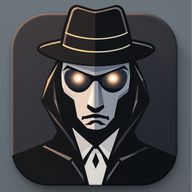

# 🎭 Undercover Game - Flutter Mobile App

<div align="center">
  
  
  **A sophisticated multiplayer party game built with Flutter**
  
  *Social deduction meets modern mobile design*

  
  
  
  
</div>

## 📱 About

**Undercover** is a beautifully crafted mobile adaptation of the popular social deduction party game. Built entirely with Flutter, it demonstrates modern mobile app development with clean architecture, internationalization, and sophisticated UI/UX design.

Perfect for parties, family gatherings, or team building events - this offline multiplayer game supports 4-20 players in an engaging battle of wit and deception.

## ✨ Key Features

### 🎮 **Core Gameplay**
- **Multiple Player Roles**: Civilians, Undercover Agents, and Mr. White
- **Dynamic Word System**: 100+ word pairs across multiple categories and difficulties
- **Flexible Game Setup**: 4-20 players with customizable undercover counts
- **Timed Descriptions**: Optional timer system for added pressure

### 🌍 **Internationalization**
- **5 Languages Supported**: English, Spanish, French, German, Chinese
- **Dynamic Language Switching**: Change language instantly without restart
- **Localized Wordpacks**: Culturally appropriate word pairs for each language
- **Persistent Language Preferences**: Saves user choice between sessions

### 🎨 **Modern UI/UX**
- **Material Design 3**: Clean, modern interface following Google's latest design system
- **Dark/Light Theme Support**: Automatic system theme detection
- **Smooth Animations**: Custom page transitions and micro-interactions
- **Responsive Design**: Optimized for all screen sizes and orientations

## 🏛️ Architecture

```
lib/
├── core/                    # Core functionality
│   ├── constants/          # App constants and enums
│   ├── themes/            # Material Design themes
│   └── utils/             # Utilities and services
├── data/                   # Data layer
│   ├── models/            # Data models
│   └── repositories/      # Data repositories
└── presentation/          # UI layer
    ├── screens/           # App screens
    └── widgets/           # Reusable UI components
```

### Key Technical Components

- **LocalizationService**: Singleton service managing app translations and language switching
- **WordRepository**: Smart word management with automatic language-based wordpack switching
- **PreferencesService**: Persistent storage for user preferences and game settings
- **GameService**: Core game logic and state management

## 🚀 Getting Started

### Prerequisites
- Flutter SDK
- Dart SDK
- Android Studio / VS Code
- Android SDK or Xcode (for platform-specific builds)

### Installation

1. **Clone the repository**
   ```bash
   git clone https://github.com/yourusername/undercover-game.git
   cd undercover-game
   ```

2. **Install dependencies**
   ```bash
   flutter pub get
   ```

3. **Run the app**
   ```bash
   flutter run
   ```

### Building for Production

**Android APK:**
```bash
flutter build apk --release
```

**iOS:**
```bash
flutter build ios --release
```

## 🎯 Game Rules

### Setup
- 4-20 players sit in a circle
- 1-3 players are secretly assigned as "Undercover Agents"
- Optionally, 1 player becomes "Mr. White" (knows no word)
- Remaining players are "Civilians"

### Gameplay
1. **Word Assignment**: Civilians get the same word, Undercover agents get a similar but different word
2. **Description Phase**: Each player describes their word in one sentence (without saying it)
3. **Discussion Phase**: Players discuss and analyze each other's descriptions
4. **Voting Phase**: Players vote to eliminate suspected undercover agents
5. **Repeat** until one team wins

### Win Conditions
- **Civilians win** by eliminating all undercover agents and Mr. White
- **Undercover agents win** by surviving until only 1 civilian remains
- **Mr. White wins** by correctly guessing the civilian word when eliminated

## 📸 Screenshots

<div align="center">
  
   

   

</div>

## 🧪 Testing

Run the comprehensive test suite:

```bash
# Unit tests
flutter test test/models/
flutter test test/repositories/

# Widget tests
flutter test test/screens/

# Integration tests
flutter test test/wordpack_test.dart
```

## 📦 Dependencies

### Core Dependencies
- `flutter_localizations` - Internationalization support
- `shared_preferences` - Local data persistence  
- `share_plus` - Social sharing functionality
- `intl` - Date and number formatting

### Development
- `flutter_lints` - Dart linting rules
- `flutter_test` - Testing framework

## 🤝 Contributing

This project demonstrates professional Flutter development practices. Key areas of focus:

1. **Code Quality**: Follows Flutter best practices and conventions
2. **Architecture**: Implements clean architecture principles
3. **Testing**: Comprehensive test coverage
4. **Documentation**: Well-documented code and APIs
5. **Accessibility**: Supports screen readers and accessibility features

## 📝 License

This project is part of a portfolio demonstration. Please contact for licensing information.

## 👨‍💻 Developer

**Joel** - Full Stack Developer

*This project showcases expertise in:*
- Flutter & Dart development
- Mobile app architecture
- Internationalization & localization
- Material Design implementation
- Cross-platform development
- Game logic and state management

---

<div align="center">
  <i>Built with ❤️ using Flutter</i>
</div>